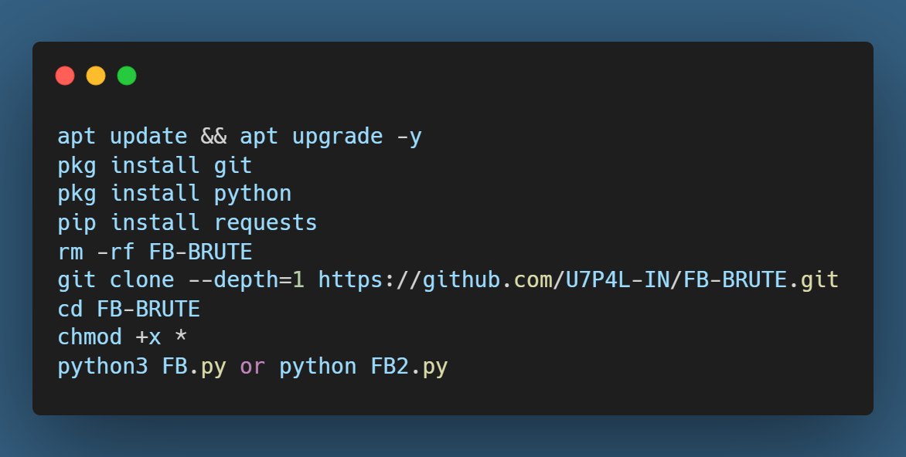
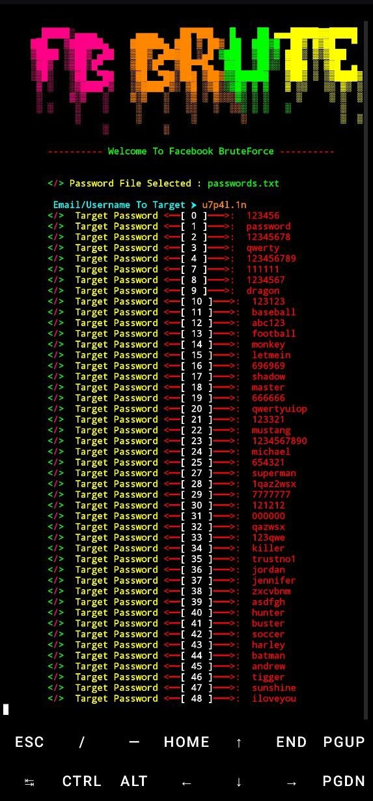
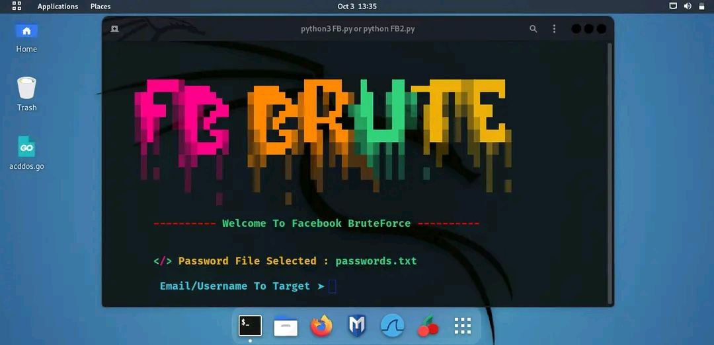
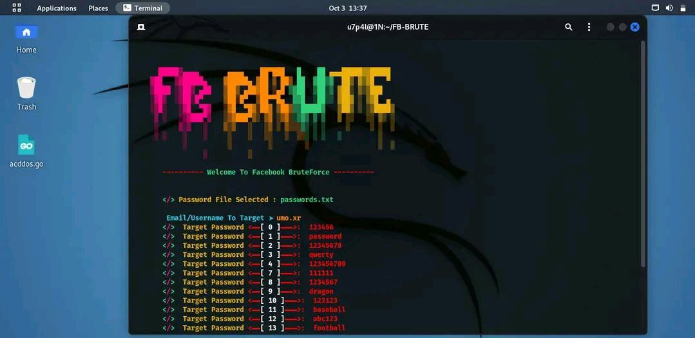

<p align="center">
</p>


<h2 align="center">FB BRUTE FORCE TOOL</h2>

  <div align="center"><a href="https://github.com/U7P4L-IN/FB-BRUTE/stargazers/"></a><a href="https://github.com/U7P4L-IN/FB-BRUTE/network/members/"></a><a href="https://github.com/U7P4L-IN/FB-BRUTE/issues"></div>
  <div align="center"></a><a href="https://github.com/U7P4L-IN/FB-BRUTE/pull"></a><a href="https://github.com/U7P4L-IN/FB-BRUTE/archive/refs/heads/master.zip"></a></div></br>

## Language</br>

 <p align="center">
</br>

* INFORMATION

> "FB Brute" refers to a type of brute force attack tool designed to guess passwords for Facebook accounts. These tools typically use a list of common passwords and systematically try them until they find the correct one1. It's important to note that using such tools to gain unauthorized access to someone's account is illegal and unethical.

<br>
<h4 align="left">About > </h4><br>

* Unlimited Usage !
* Support Newest Android also
* Working Apis
* Working with all Oparetors/Carriers
<br>
<h4 align="left">TESTED ON > </h4><br>

* Kali Linux
* Termux
* Mac os
* Ubuntu
* Perrot Sec OS

## Contributing
Feel Free To Clone This Project. For Major Changes, Please Open An Issue First To Discuss What You Would Like To Change Or Add, Thank You!!.

## Requirements 
```
python-3
pip
Internet Connection
And some other python packages
``` 
### TERMUX INSTALLATION >
```python
apt update && apt upgrade -y
pkg install git
pkg install python
pip install requests
rm -rf FB-BRUTE
git clone --depth=1 https://github.com/U7P4L-IN/FB-BRUTE.git
cd FB-BRUTE
chmod +x *
python3 FB.py or python FB2.py
```

<p align="center";> 
<p align="center";> 

## Install Requirements (on Linux)
```
>> apt-get install git python3 python3-pip python python-pip
```

## Run commands one by one
```python
>> git clone https://github.com/U7P4L-IN/FB-BRUTE.git
>> cd FB-BRUTE
>> python3 -m pip install requests bs4
>> python3 -m pip install mechanize
>> python3 FB.py or python FB2.py
```
<p align="center";> 
<p align="center";> 

## Protection Against Attacker
* Use Strong Password(which contains standard password chars + longest as possible)
* Use 2F Authentication.
* Make location based login(+browser based).
<br>
>FB-BRUTE is released under the MIT license, which grants the following permissions:
- Commercial use
- Modification
- Distribution
- Patent use
- Private use

For more convoluted language, see the [LICENSE](/LICENSE).
</br>

# Report bugs
If you notice issues while installing this tool or running this tool kindly mail to me at <a href="mailto: lisame0007@gmail.com">Gmail</a> or Open an issue via github.

<h3 align="center"><b>DESCRIPTION</b></h3>
<p align="center">
</p>

> [!NOTE]  
> All the tools are belongs to their copyright owner, and this use is in accordance with the terms and conditions of the copyright holder.

# Give A Star ⭐

> You can also give this repository a star to show more people and they can use this repository